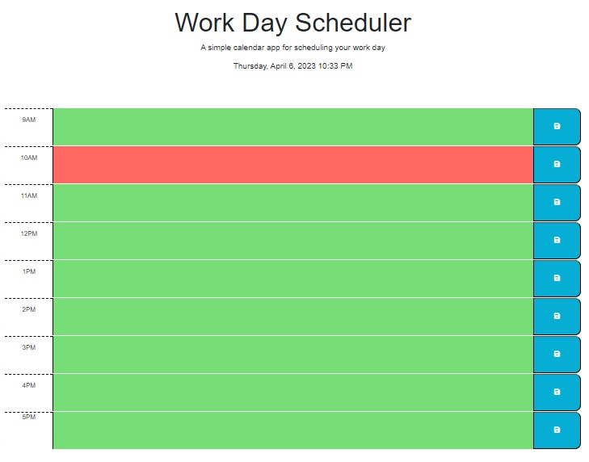

# la-semaine

## Description:
The creation of a planner that would help anyone schedule their day. The scheduler provides standard business hours of 9am through 5pm. 

## Usage
* When someone opens the scheduler, they will be presented with a color coded system noting current time in red, future time in green and past in gray. 
* They will be able to enter their data and save it.

## Live Site
[Link](https://kkitenge.github.io/la-semaine/)

An issue arose with the time. It was noticed that at 10pm the 10am timeblock became present while all other timeblocks were future. Changing the div id to match 24hrs created the future timeblocks but did not affect that current:

## Credit
* Assitance from @AskBCS Learning Assitant
* [W3Schools.com](https://www.w3schools.com)
* [Visual Studio Code](https://code.visualstudio.com)
* [GitHub](https://github.com)
